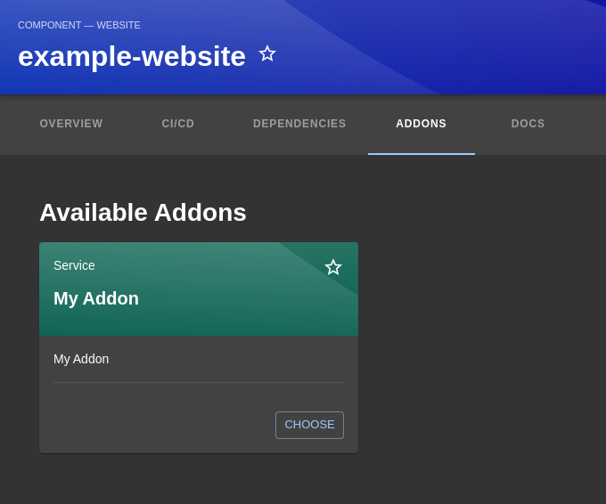

# Entity Addons

With this plugin will able to filter and extend components capabilities with *Addons* concept.



## Getting started

### Config plugin

Update `<backstage-home>/packages/app/src/components/catalog/EntityPage.tsx`:

```tsx
...
import { EntityAddonsContent } from '@k3tech/backstage-plugin-frontend-addons';
...
const defaultEntityPage = (
  <EntityLayout>
    ...
    <EntityLayout.Route path="/addons" title="Addons">
      <EntityAddonsContent variant="gridItem" />
    </EntityLayout.Route>
    
  </EntityLayout>
);
```

### Config addons template bindings

Update an `catalog-info.yaml`: 

```yaml
...
metadata:
  annotations:
    backstage.io/template-origin: template:default/my-template-origin
```

Create new template like this:

```yaml
apiVersion: scaffolder.backstage.io/v1beta3
kind: Template
metadata:
  name: my-template-origin-name-
  title: My Addon
  description: My Addon
  annotations:
    backstage.io/addon-of: template:default/my-template-origin
spec:
  type: Service
  parameters:
    - title: Component
      required:
        - component_ref
        - addon_prop
      properties:
        component_ref:
          title: Component
          type: string
          description: Filter only compatible components
          ui:field: EntityPicker
          ui:options:
            defaultNamespace: z # force to aways bind full entity ref {kind}:{namespace}/{name}
            allowedKinds:
              - Component
            catalogFilter:
              - kind: ['Component']
                'metadata.annotations.backstage.io/template-origin': 'template:default/my-template-origin'

        addon_prop:
          title: My addon property
          type: string

  steps:
    - id: component_ref_info
      name: Load Component Info
      action: catalog:fetch
      input:
        entityRef: ${{ parameters.component_ref }}

    # see
    # https://github.com/kode3tech/k3t-backstage-plugin-scaffolder-backend-module-azure-devops/blob/main/exemples.md#gitcloneazure
    - id: source
      name: 'Git Clone Component repo'
      action: git:clone:azure
      input:
        defaultBranch: main
        repoUrl: ${{ steps.component_ref_info.output.entity.metadata.annotations["backstage.io/repo-url"] }}

    - id: fetch-template
      name: Apply Addon changes
      action: fetch:template
      input:
        url: ./skeleton
        targetPath: ./
        replace: true
        values: 
          component_ref: ${{ parameters.component_ref }}
          component_ref_info: ${{ steps.component_ref_info.output.entity }}
          addon_prop: ${{ parameters.addon_prop }}

    # see
    # https://github.com/kode3tech/k3t-backstage-plugin-scaffolder-backend-module-azure-devops/blob/main/exemples.md#gitcommitazure
    - id: commit
      name: 'Commit and Push Addon changes'
      action: git:commit:azure
      input:
        createBranch: false
        defaultBranch: "feat/my-addon-upgrades"
        commitMessage: "feat: improves with my-addon"
        gitAuthorName: 'Backstage'


  output:
    links:
      - title: Repository
        url: 
          ${{ steps.component_ref_info.output.entity.metadata.annotations["backstage.io/repo-url"] }}

      - title: Open in catalog
        icon: catalog
        entityRef: ${{ parameters.component_ref }}

```
